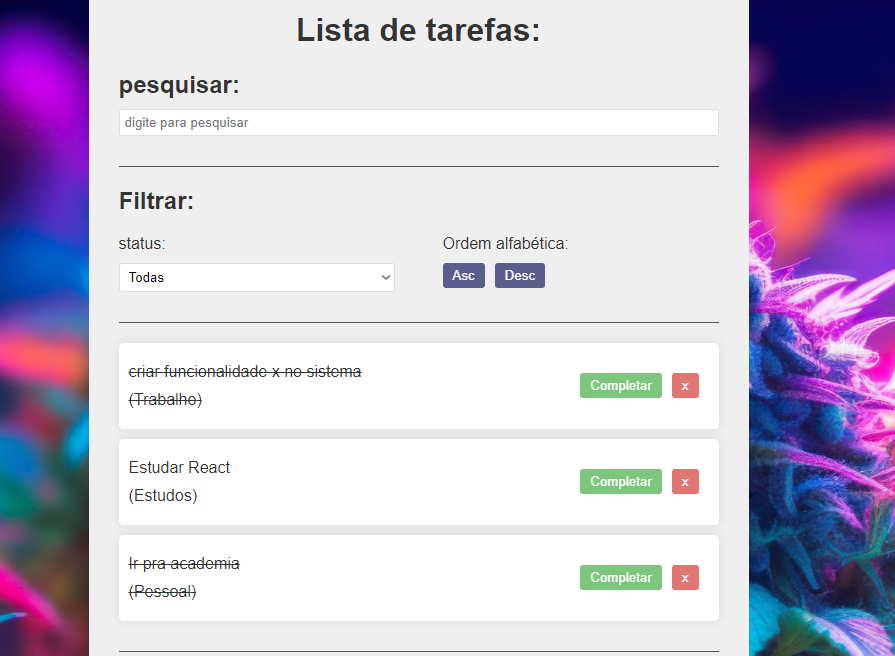

# Projeto de Todo list com React + Vite

O projeto tem como objetivo exemplificar operações básicas por meio de uma lista de tarefas,
dentre elas estão:

    1. Ver valores já presentes
    2. excluir tarefas
    3. marcar tarefa como concluída
    4. pesquisar alguma tarefa
    5. ordenar lista

    
### imagem do projeto

